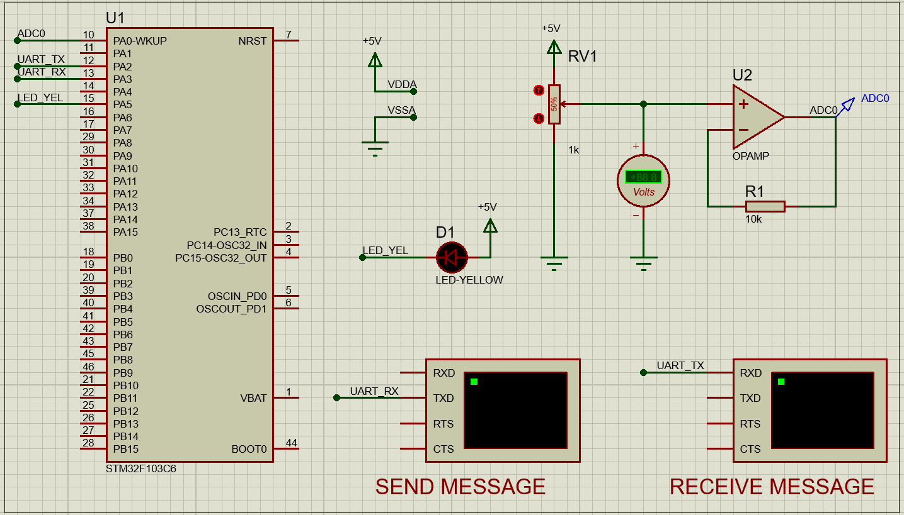

# MICROCONTROLLER - MICROPROCESSOR, LABORATORY 5

This is the fifth lab to get familiar with UART, a microcontroller communication protocol.

## 1. Schematic for this lab

I simulated the source code on an STM32F103C6 using Proteus 8. The schematic looks like this:

The pin assignments are listed in the table below:

| PIN      | PIN LABEL      | PIN      | PIN LABEL      |
|:---------|:---------------|:---------|:---------------|
| PA0      | ADC0                | PB0      | not in use     |
| PA1      | not in use          | PB1      | not in use     |
| PA2      | USART2_TX           | PB2      | not in use     |
| PA3      | USART2_RX           | PB3      | not in use     |
| PA4      | not in use          | PB4      | not in use     |
| PA5      | LED_YEL             | PB5      | not in use     |
| PA6      | not in use          | PB6      | not in use     |
| PA7      | not in use          | PB7      | not in use     |
| PA8      | not in use          | PB8      | not in use     |
| PA9      | not in use          | PB9      | not in use     |
| PA10     | not in use          | PB10     | not in use     |
| PA11     | not in use          | PB11     | not in use     |
| PA12     | not in use          | PB12     | not in use     |
| PA13     | not in use          | PB13     | not in use     |
| PA14     | not in use          | PB14     | not in use     |
| PA15     | not in use          | PB15     | not in use     |

## 2. How to run the exercises source code?

1. Ensure that all hardware connections are correct as described above. The timer is configured with prescaler = 7999, counter = 9 so the TICK is 10 ms.

2. Clone this Project and Run.